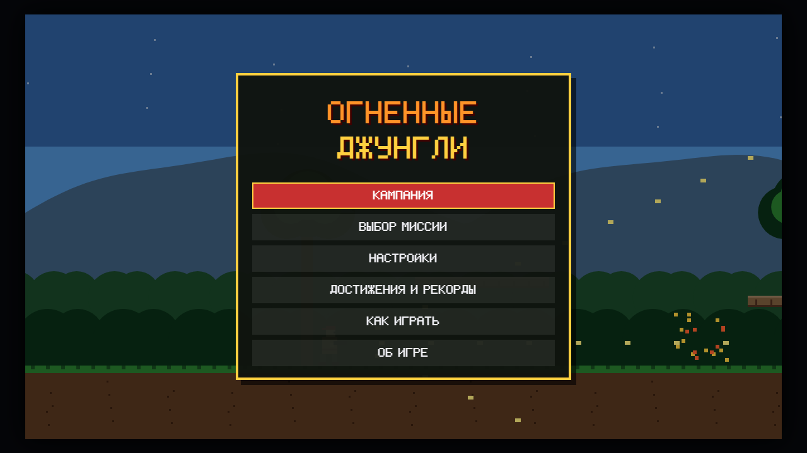
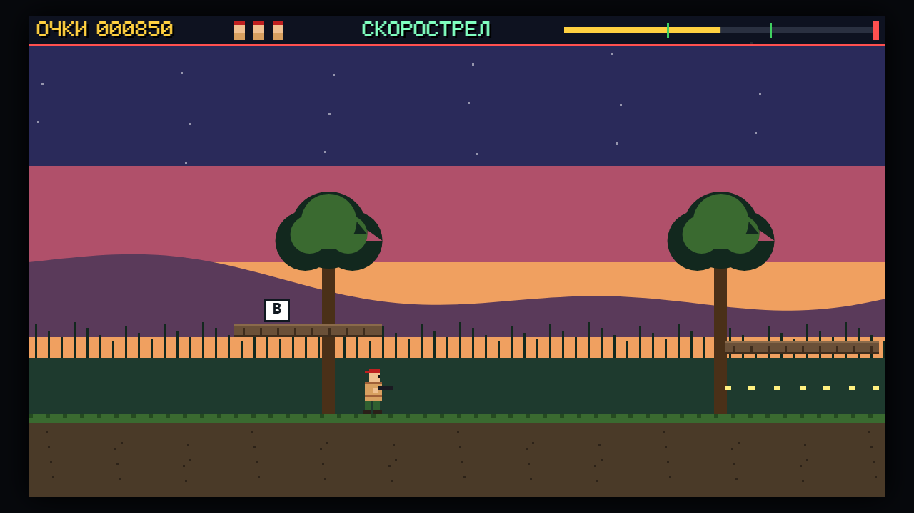
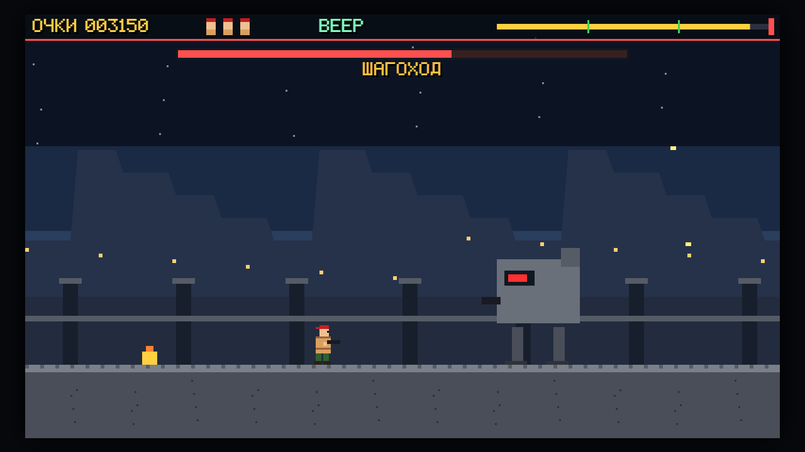

# Hot Jungle

**English** · [Русский](README.ru.md)

**Hot Jungle** («Огненные джунгли») is a run-and-gun arcade game in a single HTML page: five missions through the jungle, each ending with a boss. It runs in the browser with no server and no internet: open `index.html` or play it online.

**[▶ Play online](https://alexalesha.github.io/HotJungle/)**

> Fan-made game, not affiliated with any rights holder. Pixel sprites and the font are drawn by code.

The interface is in Russian.







## What is in the game

- **Campaign of five missions:** a jungle fort, a river at sunset, caves, a secret base and the tower assault; two checkpoint flags per mission.
- Power-ups drop from enemies and flying capsules: spread shot, rapid fire, a piercing laser and a one-hit shield; a weapon is lost with a life.
- Snipers show a red aiming beam first, mines beep, the walker sends a shock wave along the ground - jump over it.
- Mission select, achievements and records, settings, gamepad support; its own pixel font; music and sounds are synthesised with WebAudio.

## Controls

| Key | Action |
|---|---|
| A / D or arrows | run |
| W | aim up (diagonally while running) |
| S | lie down; S + jump drops through a platform |
| Space | jump |
| J / X or left mouse button | fire (hold for bursts) |
| Esc | pause |

Keys can be changed in the settings where the game offers it; a gamepad works too where noted above.

## Run locally

Open `index.html` in Chrome, Edge or Firefox. Everything is in the repository; nothing is downloaded.

## Tests

The laws are Playwright tests in `tests/`. They open the page by its file address in headless
Chromium, one at a time:

```
npm install
npx playwright install chromium
npm test
```

Mouse capture in the tests is always a stub (a real `requestPointerLock` in headless Chromium on
Windows can clip the user's cursor).
The pictures above were made headless by the screenshot script of the GameRoom collection.

## History

The game was made in the [GameRoom](https://github.com/ALEXalesha/GameRoom) collection, where it also runs in the Igroteka launcher ([play there](https://alexalesha.github.io/GameRoom/)). This repository carries the game with its commit history.

## Licence

MIT, see [LICENSE](LICENSE).
